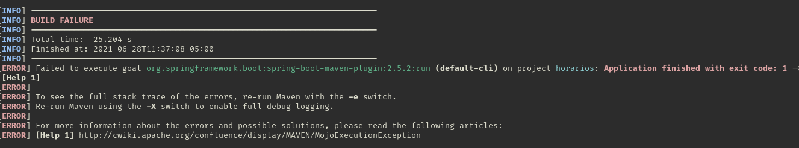

# Springboot_Error
Failed to execute goal org.springframework.boot:spring-boot-maven-plugin:2.5.2:run (default-cli) on project horarios: Application finished with exit code: 1 -> [Help 1]

- [Error_Log](https://github.com/BQPTheroy/Springboot_Error/blob/main/Error_Log)

  

- Hola buen día, tarde o noche a todos, el siguiente error (Failed to execute goal org.springframework.boot:spring-boot-maven-plugin:2.5.2:run (default-cli) on project horarios: Application finished with exit code: 1 -> [Help 1]) es un error que se ha encontrado al compilar springboot con maven, el error ha aparecido en entornos como lo es Windows y Linux.

  - Error resuelto, al omitir etiquetas de dependencias de JPA y MySQL!

